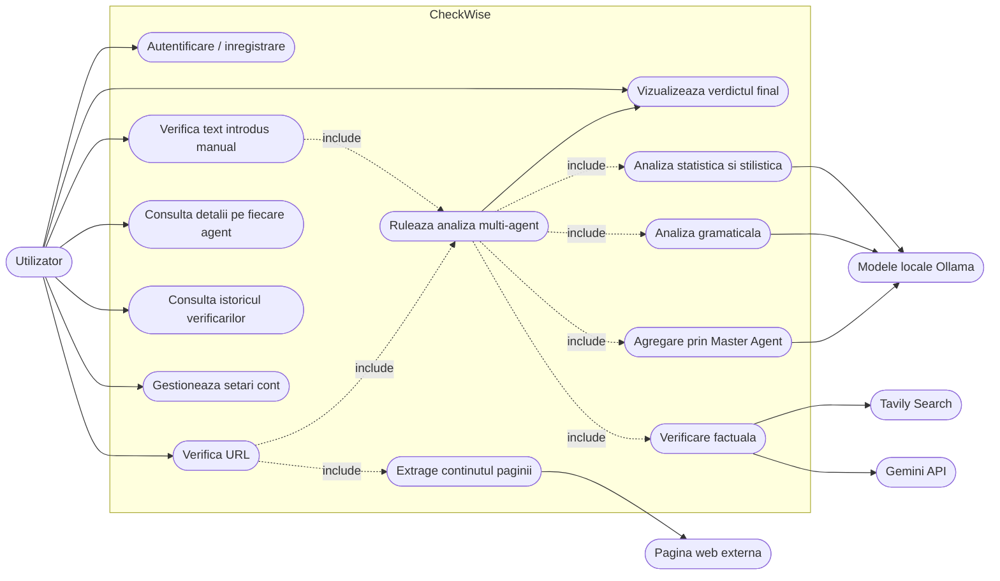
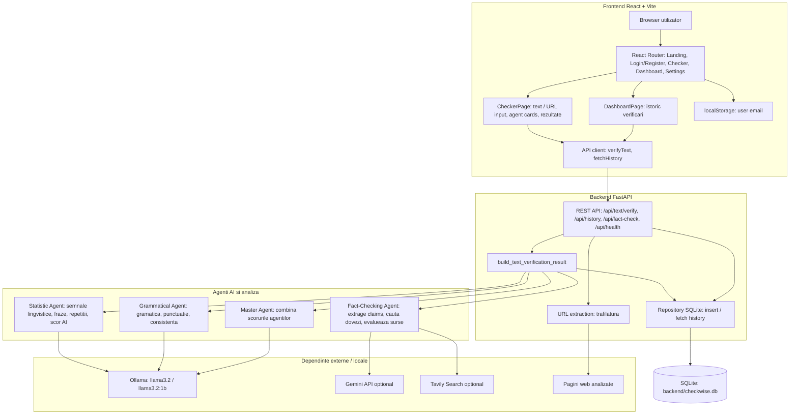
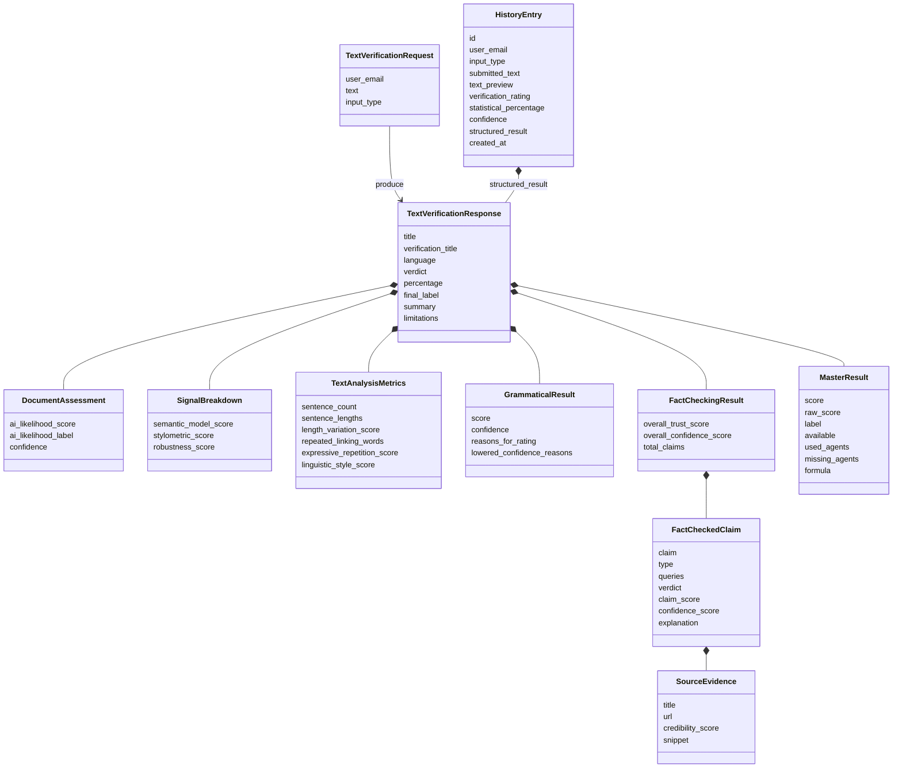
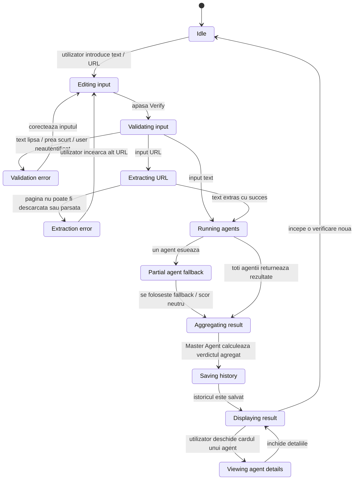
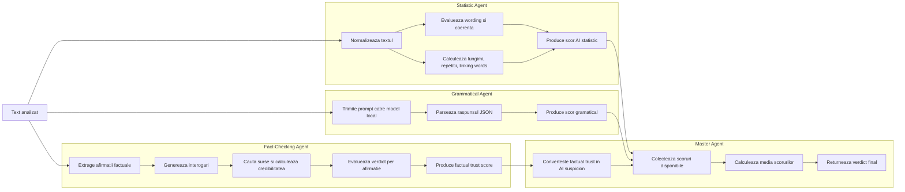

# CheckWise - Diagrame de proiect

## 1. Diagrama cazurilor de utilizare

Scop: arata functionalitatile principale ale sistemului din perspectiva utilizatorului.

## 2. Diagrama arhitecturii componentelor

Scop: arata impartirea sistemului in frontend, backend, agenti AI, servicii externe si persistenta.

## 3. Diagrama de clase / model de domeniu

Scop: evidentiaza structura statica a datelor importante schimbate intre frontend, backend, agenti si baza de date.

## 4. Diagrama de stare: ciclul unei verificari

Scop: descrie starile prin care trece o verificare pana cand utilizatorul primeste rezultatul.

## 5. Workflow logic al agentilor

Scop: arata cum contribuie fiecare agent la verdictul final.

